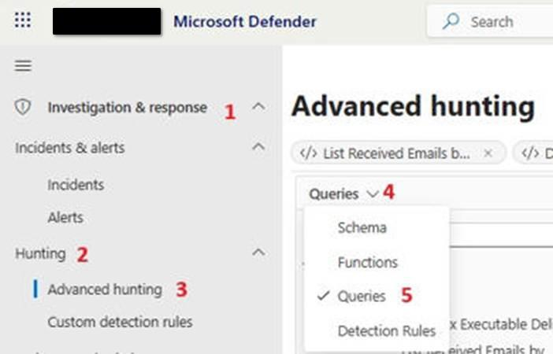

<div>

# Threat Hunting Playbook in KQL on Microsoft Defender

<div>

<div>

This playbook is a practical starting point for threat hunting with Advanced Hunting (KQL) in Microsoft Defender XDR. It is aimed at SOC analysts and threat hunters who want reusable query examples, a simple operational flow, and guidance on moving from hunting to custom detection rules.

**Scope:** phishing and email-borne threats, endpoint process activity, identity sign-in anomalies and cloud app activity.

**Prerequisites:** access to Microsoft Defender XDR Advanced Hunting, with the relevant data sources onboarded (Defender for Office 365, Defender for Endpoint, Defender for Identity / Defender for Cloud Apps).

**Disclaimer:** the queries are examples and must be reviewed, tested and tuned for your own environment before being used in production or as detection rules. All names, domains and addresses shown are placeholders.
</div>

</div>

## Objective, Purpose and Location

·       Objective: identify suspicious activity early, based on hypotheses, IoCs and TTPs, using Advanced Hunting (KQL). This tool stands out for its flexibility in searching and filtering IOC patterns.

·       Purpose: Implement advanced detection rules, whether for alerting or for automated incident response

·       Tool: Microsoft Defender portal → Investigation & Response → Hunting → Advanced hunting.

·       Shared queries: Microsoft Defender portal → Advanced Hunting → Queries → Shared Queries → company name



## Operational Flow (step by step)

1. [Define hypothesis or trigger: campaign, TTP, new IOC.](#objective-purpose-and-location)

2. [Choose sources: endpoints, identity, email, cloud apps.](#queries-kql-shared-examples-for-reuse-in-investigations)

3. [Run the base query (see examples) and validate a small sample; then widen the time window and filters.](#queries-kql-shared-examples-for-reuse-in-investigations)

4. [Enrich results: join with identity/email/alerts tables.](#hunting-best-practices-kql--operations)

5. [Prioritize events with the highest risk.](#hunting-best-practices-kql--operations)

6. [Record the IOCs found and create an incident/containment/remediation task when applicable.](#hunting-best-practices-kql--operations)

7. [Create a custom rule to detect the observed IOCs, if applicable.](#creating-rules---considerations)

## Queries (KQL) Shared Examples for Reuse in Investigations

1.     Phishing hunting (Email + Clicks) – reusable for investigations

<div>

<div>

``` jscript
//Investigation, Click Events Associated with Email Delivery events in Inboxes, for targget sender email or domain
```

    let TargetSender = "noreply@example.com";

    EmailEvents

    | where EmailDirection == "Inbound"

    | where SenderFromAddress =~ TargetSender // change variable as needed ex: SenderFromDomain / SenderFromAddress

    | where DeliveryAction == "Delivered"

    | where LatestDeliveryLocation in ("Inbox/folder") // options ("Inbox/folder","Junk Folder","Quarantine","Deleted items folder","On-prem/external)

    | project

        TimeEmail = Timestamp,

        SenderFromAddress,

        RecipientEmailAddress,

        Subject,

        ThreatTypes,

        LatestDeliveryLocation,

        NetworkMessageId

    | join kind=leftouter (

        UrlClickEvents

        | where Workload == "Email"

        | project

            NetworkMessageId,

            TimeClick = Timestamp,

            Url,

            ActionType,

            IsClickedThrough,

            ClickRecipient = AccountUpn

    ) on NetworkMessageId

    | extend Clicked = iff(isnotempty(TimeClick), "yes", "no")

    | order by TimeEmail desc

</div>

</div>

2.     Hunt potentially malicious URLs pointing to executables – reusable for investigations or rules

<div>

<div>

``` jscript
//OBJECTIVE look for potencial malicious URL that point to executable files
```

    //ATTENTION - BE AWARE OFF EXCEPTIONS CREATED BELLOW

    let ClickedUrls =

        UrlClickEvents

        | project

            NetworkMessageId,

            Url,

            ClickedTime = Timestamp;

    EmailUrlInfo

    | where tolower(Url) has ""                         //add exact expressions to look for

    //| where not(tolower(Url) has_any ("dropbox.com","lexmark.com")) //EXCEPTIONS to not look for!!!!!! reduce double alerts

    | extend FileExt = extract(@"\.([a-zA-Z0-9]+)(\?|$)", 1, Url)

    | extend FileName = extract(@"/([^/?#]+)(?:\?|#|$)", 1, Url)

    | where tolower(FileExt) in ("exe","msi","hta","ps1","vb","vbe","lnk","cmd","ws","wsf","bat")

    | where not(Url matches regex @"(?i)\.(exe|msi)\.(png|jpg|txt|pdf)")

    | join kind=inner EmailEvents on NetworkMessageId

    //

    | where DeliveryAction == "Delivered" 

    //| where DeliveryLocation == "Inbox/folder"

    | where LatestDeliveryLocation == "Inbox/folder"    //"Deleted items", "Inbox/folder", "Forwarded", "On-premises/external"

    //

    // joins clicks information

    | join kind=leftouter ClickedUrls on NetworkMessageId, Url

    | extend Clicks = iff(isnotempty(ClickedTime), "YES", "NO")

    //

    //exclutions for intern domains

    | where RecipientEmailAddress !in ("soc@domain.pt")

    | where

        SenderFromDomain !in ("domain.pt", "parceiro.domain.pt")

        or SenderFromAddress in (

            "email_example@sss.pt"

        )

    //whitelisting reviewed 18/05/2026, should remove after 15/06/2026 "commum-email-example@domain.com"

    | where SenderFromAddress !in ("commum-email-example@domain.com")

    // severity 

    | extend Severity = case(

        Clicks == "YES", "High",

        LatestDeliveryLocation == "Inbox/folder", "Medium",

        "LOW"

    )

    | project

        Timestamp,

        SenderFromAddress,

        RecipientEmailAddress,

        Subject,

        Url,

        FileName,

        FileExt,

        Clicks, 

        DeliveryAction,

        DeliveryLocation,

        LatestDeliveryLocation,

        Severity,

        ThreatTypes,

        InternetMessageId,

        RecipientObjectId,

        NetworkMessageId,

        ReportId

    |sort by Timestamp

</div>

</div>

3.     Phishing hunting by .pdf attachments

<div>

<div>

``` jscript
// This querie looks for a specific PDF attachment by expression (example) file name
```

    EmailAttachmentInfo

    | where tolower(FileName) matches regex tolower(@"*(example).*\.pdf") //change regex as needed

    | join kind=inner EmailEvents on NetworkMessageId

    | where DeliveryAction == "Delivered"

    // comment/uncomment, to validade every case for risk analysis!

    //| where DeliveryLocation == "Inbox/folder"

    | where LatestDeliveryLocation == "Inbox/folder"

    | where RecipientEmailAddress != "soc@domain.pt"

    | project

        Timestamp,

        SenderFromAddress,

        RecipientEmailAddress,

        Subject,

        FileName,

        FileSize,

        LatestDeliveryLocation,

        DeliveryLocation,

        DeliveryAction,

        ThreatTypes,

        SHA256

    | order by Timestamp desc

</div>

</div>

4.     Phishing hunting by .zip attachments

<div>

<div>

``` jscript
//This querie looks for expecific reg.expression in email ZIP files attachments 
```

    EmailAttachmentInfo

    | where FileType == "zip"

    | where tolower(FileName) matches regex tolower(@"(comprovativo-janeiro|comprovativo-fevereiro|comprovativo-março|comprovativo-abril|comprovativo-maio|comprovativo-junho|comprovativo-julho|comprovativo-agosto|comprovativo-setembro|comprovativo-outubro|comprovativo-novembro|comprovativo-dezembro).*\.zip") //change values as needed

    | join kind=inner EmailEvents on NetworkMessageId

    | where DeliveryAction == "Delivered"

    //comment/uncomment, to validate everycase for risk analisys!

    //| where DeliveryLocation == "Inbox/folder"

    | where LatestDeliveryLocation == "Inbox/folder"

    | where RecipientEmailAddress != "soc@domain.pt"

    | project

        Timestamp,

        SenderFromAddress,

        RecipientEmailAddress,

        Subject,

        FileName,

        FileSize,

        LatestDeliveryLocation,

        DeliveryLocation,

        DeliveryAction,

        ThreatTypes,

        InternetMessageId,

        RecipientObjectId,

        NetworkMessageId,

        SHA256

    | order by Timestamp desc

</div>

</div>

5.     Anomaly investigation, listing and enumeration

<div>

<div>

``` jscript
//Querie to list emails delivered from SenderFromDomain, by Recipient and Subject
```

    EmailEvents

    | where Timestamp >= ago(1d)

    | where SenderFromDomain == "example.com"

    | where DeliveryAction == "Delivered"

    | project

        Timestamp,

        RecipientEmailAddress,

        Subject

    | sort by Timestamp desc

    | summarize

        EmailsPorRecipiente = count(),

        EmailsDetalhe = make_list(

            pack(

                "Timestamp", Timestamp,

                "Subject", Subject

            )

        )

        by RecipientEmailAddress

    | sort by EmailsPorRecipiente desc

    | summarize

        TotalEmails = sum(EmailsPorRecipiente),

        TotalRecipientes = dcount(RecipientEmailAddress),

        Detalhe = make_list(

            pack(

                "Recipient", RecipientEmailAddress,

                "Emails", EmailsPorRecipiente,

                "DetalheEmails", EmailsDetalhe

            )

        )

</div>

</div>

6.     Investigation of possible phishing by rare domains vs. reception across multiple recipient mailboxes

<div>

<div>

``` jscript
let RareDomainThreshold = 20;
```

    let TotalSenderThreshold = 2;

    let RareDomains = EmailEvents

    | summarize TotalDomainMails = count() by SenderFromDomain

    | where TotalDomainMails <= RareDomainThreshold

    | project SenderFromDomain;

    EmailEvents

    | where EmailDirection == "Inbound"

    | where SenderFromDomain in (RareDomains)

    | where LatestDeliveryAction == "Delivered"

    | where DeliveryLocation == "Inbox/folder"

    | where isnotempty(EmailClusterId)

    | join kind=inner EmailUrlInfo on NetworkMessageId

    | summarize

        Subjects = make_set(Subject),

        Senders = make_set(SenderFromAddress),

        Recipients = make_set(RecipientEmailAddress),

        TotalRecipients = dcount(RecipientEmailAddress)

      by EmailClusterId

    | extend TotalSenders = array_length(Senders)

    | where TotalSenders >= TotalSenderThreshold

</div>

</div>

7.     Similar cases by IMID. Useful to find similar emails and clicks.

<div>

<div>

``` jscript
let EmailsDoSender =
```

    EmailEvents

    //| where Timestamp > ago(30d)

    | where InternetMessageId == "<iddddddddddddddddddd.prod.outlook.com>"

    //| where InternetMessageId has "prod.outlook.com"

    | project TimeEmail = Timestamp,

              RecipientEmailAddress,

              SenderFromAddress,

              SenderFromDomain,

              Subject,

              ThreatTypes,

              DeliveryLocation,

              InternetMessageId,

              NetworkMessageId;

    EmailsDoSender

    | join kind=leftouter ( 

        UrlClickEvents

        | where Workload == "Email"

        | where ActionType == "ClickAllowed" or IsClickedThrough != "0"

        | project NetworkMessageId,

                  TimeClick = Timestamp,

                  Url,

                  UrlChain,

                  ActionType,

                  IsClickedThrough

    ) on NetworkMessageId

</div>

</div>

8.     Hunting - Track multi-stage spam/phishing cases by fingerprinting. (example)

<div>

<div>

``` jscript
//target campaign may spam/phis
```

    //query maintained tabastos

    EmailEvents

    | where Subject contains "Collaboration - Ref ID:"

    | where LatestDeliveryLocation == "Inbox/folder"

    | where RecipientEmailAddress !in ("soc@domain.pt")

    | project Timestamp, RecipientEmailAddress, Subject, 

            SenderFromAddress, SenderFromDomain, 

            ThreatTypes, LatestDeliveryLocation, NetworkMessageId

    | order by Timestamp desc

</div>

</div>

9.     Endpoint hunting – suspicious child processes spawned by Office applications (DeviceProcessEvents)

<div>

<div>

``` jscript
//OBJECTIVE look for suspicious child processes launched by Office/email applications (possible phishing payload execution)
```

    let LookbackPeriod = 1d;

    DeviceProcessEvents

    | where Timestamp >= ago(LookbackPeriod)

    | where InitiatingProcessFileName in~ ("winword.exe","excel.exe","powerpnt.exe","outlook.exe","onenote.exe")

    | where FileName in~ ("powershell.exe","pwsh.exe","cmd.exe","wscript.exe","cscript.exe","mshta.exe","rundll32.exe","regsvr32.exe","certutil.exe","bitsadmin.exe")

    //| where DeviceName !in ("example-device") //EXCEPTIONS to not look for, reduce double alerts

    | project

        Timestamp,

        DeviceName,

        AccountDomain,

        AccountName,

        InitiatingProcessFileName,

        InitiatingProcessCommandLine,

        FileName,

        ProcessCommandLine,

        FolderPath,

        SHA256,

        ReportId

    | order by Timestamp desc

</div>

</div>

10.     Identity hunting – possible password spray followed by successful logon (IdentityLogonEvents)

<div>

<div>

``` jscript
//OBJECTIVE look for IP addresses failing logons against multiple accounts, followed by a successful logon from the same IP
```

    let LookbackPeriod = 1d;

    let FailedThreshold = 10;

    let AccountThreshold = 5;

    let SprayIPs =

        IdentityLogonEvents

        | where Timestamp >= ago(LookbackPeriod)

        | where ActionType == "LogonFailed"

        | where isnotempty(IPAddress)

        | summarize

            FailedLogons = count(),

            TargetedAccounts = dcount(AccountUpn),

            FirstFailure = min(Timestamp)

          by IPAddress

        | where FailedLogons >= FailedThreshold

        | where TargetedAccounts >= AccountThreshold;

    IdentityLogonEvents

    | where Timestamp >= ago(LookbackPeriod)

    | where ActionType == "LogonSuccess"

    | join kind=inner SprayIPs on IPAddress

    | where Timestamp >= FirstFailure

    | project

        Timestamp,

        AccountUpn,

        AccountDisplayName,

        IPAddress,

        Location,

        ISP,

        Application,

        LogonType,

        FailedLogons,

        TargetedAccounts,

        FirstFailure,

        ReportId

    | order by Timestamp desc

</div>

</div>

11.     Cloud apps hunting – suspicious inbox rules created after a possible phishing compromise (CloudAppEvents)

<div>

<div>

``` jscript
//OBJECTIVE look for inbox rules that forward, redirect or delete messages (common persistence/exfiltration after a phishing compromise)
```

    let LookbackPeriod = 7d;

    CloudAppEvents

    | where Timestamp >= ago(LookbackPeriod)

    | where Application == "Microsoft Exchange Online"

    | where ActionType in ("New-InboxRule","Set-InboxRule")

    | extend RuleParameters = tostring(RawEventData.Parameters)

    | where RuleParameters has_any ("ForwardTo","ForwardAsAttachmentTo","RedirectTo","DeleteMessage","MoveToFolder")

    | project

        Timestamp,

        AccountDisplayName,

        AccountObjectId,

        ActionType,

        IPAddress,

        CountryCode,

        ISP,

        UserAgent,

        RuleParameters,

        ReportId

    | order by Timestamp desc

</div>

</div>

## Hunting Best Practices (KQL + Operations)

·       Iterate quickly: start with specific filters (time/host/account) and widen gradually.

·       Document hypotheses, queries, results and decisions; reuse approved snippets.

·       Use summarize and join sparingly to avoid high costs/time; project only useful columns.

·       Enrich with identity and email telemetry for person and campaign context.

·       Create bookmarks and export results for later investigation/automation.

·       Rules require proper optimization to reduce false positives.

## Creating Rules - Considerations

·       They must be well optimized before taking actions, to avoid false positives.

·       They must be approved and coordinated with SOC IR in order to aggregate alerts in the SIEM/SOAR

·       Relevant documentation: [Create custom detection rules in Microsoft Defender XDR - Microsoft Defender XDR \| Microsoft Learn](https://learn.microsoft.com/en-us/defender-xdr/custom-detection-rules)

## Common Mistakes and How to Avoid Them

·       Queries without a time limit → use an appropriate ago() and only then widen, or define a custom time window in the top bar.

·       Selecting too many columns → use project early to reduce cost/latency.

·       Unnecessary heavy join → validate hypotheses on a single table before correlating.

## References

·       [Create custom detection rules in Microsoft Defender XDR - Microsoft Defender XDR \| Microsoft Learn](https://learn.microsoft.com/en-us/defender-xdr/custom-detection-rules)

·       [Overview - Advanced hunting - Microsoft Defender XDR \| Microsoft Learn](https://learn.microsoft.com/en-us/defender-xdr/advanced-hunting-overview)

·       [Custom detection rules in Microsoft Defender - short guide \| Kacper SecOps-Blog](https://kacyper44.github.io/defender/2024/12/01/Custom-detection-rules.html)


</div>
