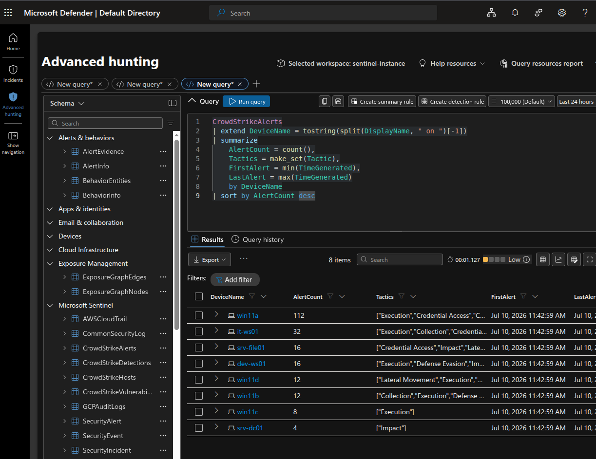
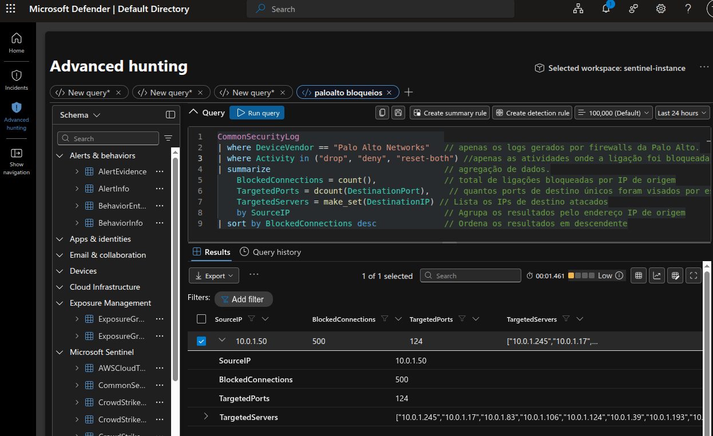
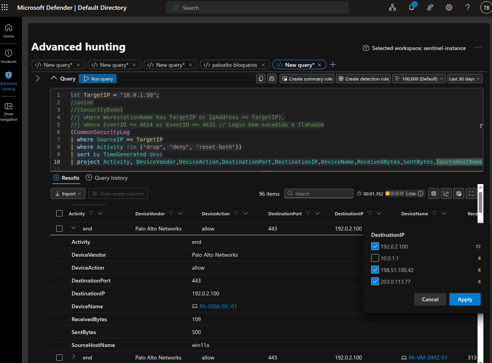
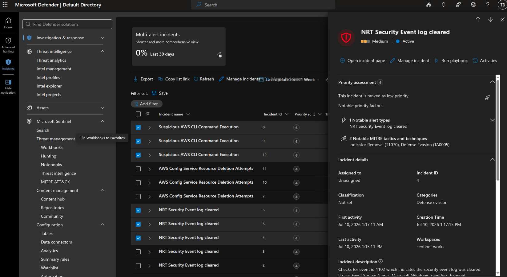
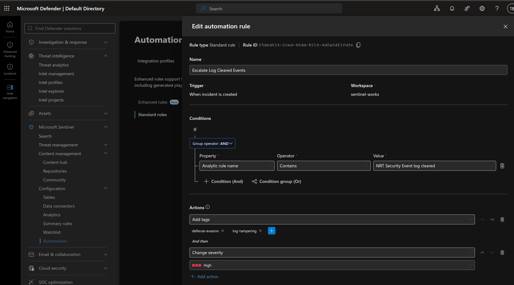

# 🛡️ MS Sentinel & Microsoft Defender XDR Threat Hunting Operations Lab

[](#-work-in-progress-wip-justification--operational-roadmap)
[](https://opensource.org/licenses/MIT)
[](https://azure.microsoft.com/en-us/products/microsoft-sentinel/)
[](https://security.microsoft.com/)

A unified security investigation, threat hunting lab, and operational case study demonstrating real-world incident analysis, proactive KQL threat hunting, C2 exfiltration detection, defense evasion response, and SOC automation using **Microsoft Sentinel** and **Microsoft Defender XDR**.

---

## ⚠️ WORK IN PROGRESS (WIP) & OPERATIONAL ROADMAP

> **Notice**: This repository and security case study documentation are currently maintained in a **Work in Progress (WIP)** state. The section below integrates the core architectural models, threat hunting hypotheses, and response playbooks, this investigation is actively evolving, some parts maybe not be documented.

### 1. 🔍 Threat Hunting Methodology & Hypothesis-Driven Probing
Our threat hunting lifecycle follows an iterative hypothesis-driven framework based on the **MITRE ATT&CK** matrix. The WIP status reflects ongoing validation across three core phases:

* **Phase 1 — Endpoint Anomaly Detection**:
  * *Hypothesis*: Workstations accumulating multi-tactical EDR alerts (e.g., `Execution` + `Defense Evasion`) indicate active host compromise rather than isolated malware execution.
  * *Status*: Verified. Identified pivot host `win11a` (`10.0.1.50`) with **112 alerts**.
* **Phase 2 — Perimeter Network & Exfiltration Validation**:
  * *Hypothesis*: Compromised endpoints attempt internal network scanning before establishing encrypted outbound Command & Control (C2) channels.
  * *Status*: Verified. Detected **500 blocked port scans** and **183 MB encrypted HTTPS exfiltration** via Palo Alto firewall telemetry.
* **Phase 3 — Anti-Forensic Tracking & Automated Escalation**:
  * *Hypothesis*: Adversaries clear Windows audit logs (Event ID 1102) prior to disconnecting or shifting tactics.
  * *Status*: Active. Implemented Sentinel automation rule `Escalate Log Cleared Events` to auto-tag and elevate incident severity to **High**.

### 2. 🏗️ Architecture & Ingestion Telemetry Expansion
The threat hunting lab integrates telemetry across endpoints, perimeter firewalls, and Windows domain controllers into a unified **Microsoft Sentinel** workspace (`sentinel-works`).

| Data Source | Schema / Table Name | Current Operational Telemetry & Ingestion Status |
| :--- | :--- | :--- |
| **CrowdStrike EDR** | `CrowdStrikeAlerts` | Ingests endpoint alert telemetry, process execution trees, and MITRE tactics. *WIP: Expanding cloud log forwarding agent coverage to eliminate residual endpoint blind spots.* |
| **Palo Alto Networks NGFW** | `CommonSecurityLog` | Captures CEF-formatted traffic, threat, and URL filtering logs from perimeter firewall `PA-3260-DC-01`. |
| **Windows Security Events** | `SecurityEvent` | Ingests Windows OS security events (Logins Event ID 4624/4625, Audit Log Clearing Event ID 1102). |
| **Microsoft Sentinel Alerts** | `SecurityAlert` / `SecurityIncident` | Stores native analytic rule triggers, automated incident correlations, and tagging metadata. |

### 3. 🚨 SOC Incident Response & Containment Playbook
When high-severity data exfiltration or anti-forensic activity is confirmed, the following standardized operational containment playbook is executed:

1. **Immediate Endpoint Containment**:
   * Isolate compromised host `10.0.1.50` (`win11a`) from the network via Defender for Endpoint / EDR API to halt ongoing exfiltration.
   * Suspend associated user credentials in Azure Active Directory / Entra ID.
2. **Perimeter Network Isolation**:
   * Push external C2 destination IPs (`192.0.2.100`, `198.51.100.42`, `203.0.113.77`) to Palo Alto dynamic perimeter blocklists.
3. **Forensic Acquisition & Recovery (In Progress)**:
   * Perform volatile memory acquisition (RAM dump) and disk image acquisition on host `win11a`.
   * Re-image endpoint and audit adjacent subnets for dormant persistence mechanisms or secondary web shells.

---

## 📌 Executive Summary

This repository documents a multi-stage security incident investigation conducted within a Microsoft Sentinel and Defender XDR unified SecOps platform. The investigation traces an attacker's activity from initial network reconnaissance to Command and Control (C2) communication, large-scale data exfiltration, and defense evasion via log tampering.

### 🎯 Key Highlights & Attack Lifecycle
1. **Multi-Stage Endpoint Alerts**: Identified compromised pivot host (`win11a`) displaying alerts across multiple MITRE ATT&CK tactics via CrowdStrike telemetry.
2. **Network Reconnaissance**: Uncovered internal port scanning activity from host `10.0.1.50` hitting 124 unique destination ports across 500 blocked connections in Palo Alto firewall logs.
3. **C2 & Encrypted Data Exfiltration**: Detected allowed HTTPS/SSL outbound sessions to known C2 infrastructure, including a single payload transfer of **182,986,352 bytes (~183 MB)**.
4. **Defense Evasion & Automation**: Detected Windows Security Event Log clearing (Event ID 1102) and configured automated Sentinel rules to dynamically escalate incident severity to **High** and attach incident tags (`defense-evasion`, `log-tampering`).

---

## 🔬 Case Study 1: EDR Threat Hunting & Multi-Stage Attack Analysis

### 🎯 Objective
Investigate endpoint alert distribution across the environment to spot high-risk compromised hosts acting as potential attack pivot points.

### 🔍 KQL Query: CrowdStrike Alert Aggregation
```kql
CrowdStrikeAlerts
| extend DeviceName = tostring(split(DisplayName, " on ")[-1])
| summarize
    AlertCount = count(),
    Tactics = make_set(Tactics),
    FirstAlert = min(TimeGenerated),
    LastAlert = max(TimeGenerated)
    by DeviceName
| sort by AlertCount desc
```

### 🖼️ Evidence & Execution


### 📸 Screenshot & Findings (`img1_crowdstrike.png`)
* **Evidence Ingestion**: The screenshot displays Microsoft Defender's **Advanced Hunting** query editor running KQL against `CrowdStrikeAlerts`.
* **Primary Target / Pivot Host**: Host **`win11a`** accumulated **112 alerts**, spanning key MITRE ATT&CK tactics (`Execution`, `Credential Access`, `Defense Evasion`, and `Impact`) starting at `Jul 10, 2026 11:42:59 AM`.
* **Secondary Compromised Hosts**: Displays secondary infected assets including `it-ws01` (32 alerts), `srv-file01` (16 alerts), `dev-ws01` (16 alerts), `win11d` (12 alerts), `win11b` (12 alerts), `win11c` (8 alerts), and `srv-dc01` (4 alerts).
* **MITRE ATT&CK Alignment**: Multiple alerts across distinct tactics on a single endpoint confirm that host `win11a` was actively compromised and utilized as a primary internal pivot host.

---

## 🔬 Case Study 2: Network Reconnaissance, C2, and Data Exfiltration

### 2.1 Proactive Reconnaissance Detection

#### 🎯 Objective
Identify internal hosts engaging in network scanning or port probing activities by analyzing blocked connection attempts in Palo Alto firewall logs.

#### 🔍 KQL Query: Palo Alto Blocked Connections
```kql
CommonSecurityLog
| where DeviceVendor == "Palo Alto Networks"
| where Activity in ("drop", "deny", "reset-both")
| summarize
    BlockedConnections = count(),
    TargetedPorts = dcount(DestinationPort),
    TargetedServers = make_set(DestinationIP)
    by SourceIP
| sort by BlockedConnections desc
```

#### 🖼️ Evidence & Execution


#### 📸 Screenshot & Findings (`img2_paloalto.png`)
* **Evidence Ingestion**: The screenshot shows Advanced Hunting executing over firewall telemetry (`CommonSecurityLog`), filtering specifically for dropped or denied packets.
* **Source IP Identification**: Highlights internal IP **`10.0.1.50`** (`win11a`) as the top originator of denied traffic.
* **Scan Magnitude**: **500 blocked connection attempts** probing **124 distinct destination ports** across internal servers (`10.0.1.245`, `10.0.1.17`, `10.0.1.83`, `10.0.1.106`, `10.0.1.124`, `10.0.1.39`, `10.0.1.193`).
* **Security Assessment**: Proves systematic internal port scanning, establishing clear evidence of active network reconnaissance prior to exploitation attempts.

---

### 2.2 Deep Dive Investigation: C2 Communication & Exfiltration

#### 🎯 Objective
Examine outbound traffic from suspect host `10.0.1.50` to determine whether command-and-control channels or data exfiltration occurred.

#### 🔍 KQL Query: Outbound Connections & Data Volume
```kql
let TargetIP = "10.0.1.50";
CommonSecurityLog
| where SourceIP == TargetIP
| where Activity !in ("drop", "deny", "reset-both")
| sort by TimeGenerated desc
| project Activity, DeviceVendor, DeviceAction, DestinationPort, DestinationIP, DeviceName, ReceivedBytes, SentBytes, SourceHostName
```

#### 🖼️ Evidence & Execution


#### 📸 Screenshot & Findings (`img3_paloalto.png`)
* **Evidence Ingestion**: Advanced Hunting results showing permitted outbound sessions from host `10.0.1.50`.
* **Outbound Policy**: Demonstrates that firewall policy `Allow-Outbound` permitted outbound sessions over port **443 (HTTPS/SSL)** via device `PA-3260-DC-01`.
* **External C2 Infrastructure**: Identifies active communication sessions established with external IPs **`192.0.2.100`** (72 sessions), **`198.51.100.42`** (8 sessions), and **`203.0.113.77`** (8 sessions).
* **Data Exfiltration Evidence**: Details a massive single transfer session of **182,986,352 bytes (~183 MB)** transmitted over an encrypted HTTPS channel.
* **Verdict**: Confirms that host `10.0.1.50` maintained an active C2 communication link and successfully exfiltrated internal data.

---

### 2.3 Lateral Movement Verification

#### 🎯 Objective
Determine if host `10.0.1.50` successfully authenticated or moved laterally to other internal assets.

#### 🔍 KQL Query: Windows Security Authentication Logs
```kql
let TargetIP = "10.0.1.50";
SecurityEvent
| where WorkstationName has TargetIP or IpAddress == TargetIP
| where EventID in (4624, 4625) // Successful and Failed Logins
```

#### 📊 Findings & Analysis
* **Result**: No successful or attempted logins were found in `SecurityEvent` originating from `10.0.1.50`.
* **Conclusion**: Lateral movement via standard Windows authentication (Kerberos/NTLM) had not yet succeeded at the time of detection, confining primary active exfiltration to `win11a`.

---

## 🔬 Case Study 3: Defense Evasion & Incident Automation

### 3.1 Detection of Event Log Tampering

#### 🎯 Objective
Detect adversary attempts to cover their tracks by clearing Windows Security Event logs.

#### 🖼️ Evidence & Execution


#### 📸 Screenshot & Findings (`img4_security_eventlog.png`)
* **Evidence Ingestion**: Displays the Microsoft Defender Incidents dashboard for workspace `sentinel-works`.
* **Incident Details**: Shows Incident ID **4** titled **`NRT Security Event log cleared`** with initial severity set to **Medium**.
* **MITRE ATT&CK Mapping**: Side panel details map the event to Windows Event ID **1102** (Security Event Log Cleared), aligning with **Defense Evasion (`TA0005`)** and **Indicator Removal (`T1070`)**.
* **Validation**: Confirms that after exfiltrating data, the attacker performed anti-forensic log clearing to disrupt SOC visibility.

---

### 3.2 Automated Severity Escalation & Tagging

#### 🎯 Objective
Implement automated incident handling to immediately elevate severity and apply SecOps tags when defense evasion activities occur.

#### 🖼️ Evidence & Execution


#### 📸 Screenshot & Findings (`img5_automation_standart_rule.png`)
* **Evidence Ingestion**: Displays the Sentinel Automation Rule configuration interface in Microsoft Defender portal.
* **Rule Metadata**: Shows Automation Rule Name **`Escalate Log Cleared Events`** (Rule ID `f5ded614-2ced-4fdd-8214-4d0a0df1fdfe`).
* **Trigger Condition**: Activated `IF Analytic rule name Contains "NRT Security Event log cleared"`.
* **Automated Actions Executed**:
  1. **Tagging**: Attaches SecOps tags **`defense-evasion`** and **`log-tampering`**.
  2. **Severity Escalation**: Dynamically elevates incident severity from `Medium` to **`High`**.
* **Operational Impact**: Proves that automated SOC guardrails were established to ensure high-priority handling of anti-forensic events.

---

## 💡 Lessons Learned & Security Recommendations

* **EDR Cloud Ingestion Coverage**: At the onset of the incident, EDR/Antivirus logs for the host were not being forwarded to the cloud SIEM. Ensuring 100% endpoint telemetry coverage is critical to eliminate SOC blind spots.
* **Strict Outbound Egress Control**: Standard HTTPS (443) outbound traffic allowed large encrypted data transfers to unmapped public IPs. Implement SSL/TLS inspection and DNS/IP threat intelligence filtering on outbound gateways.
* **Automated Containment Rules**: Expanding Sentinel automation rules to trigger automated host isolation playbooks (Logic Apps) upon log clearing events significantly reduces Mean Time to Respond (MTTR).
